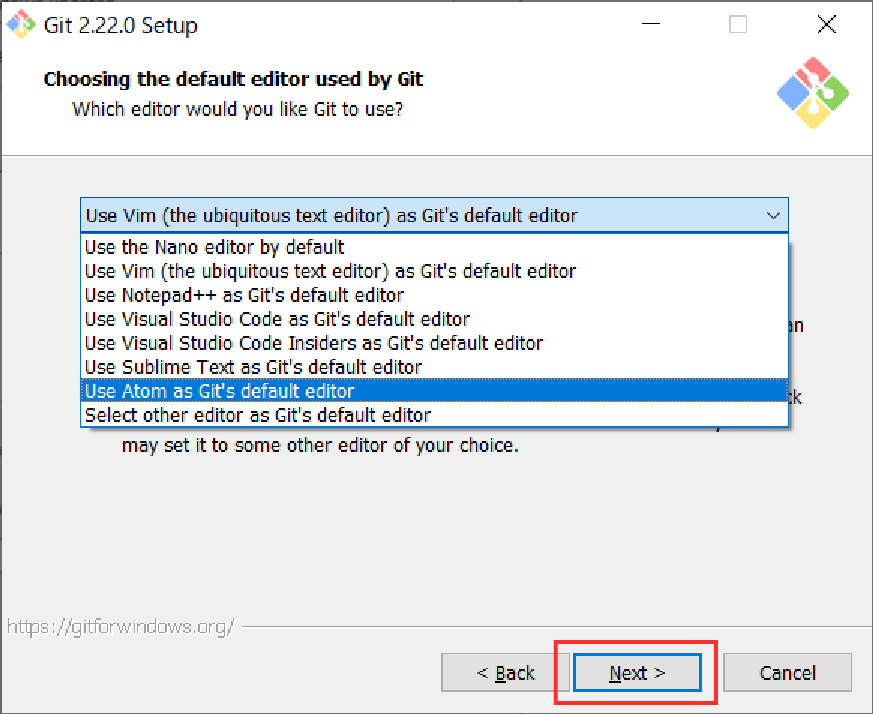

# Git Local Environment Setup (Windows)

In this article we will cover how to set up a local environment in order to use Git on your own Windows PC. Let's go through the steps and get you set up!

**What You Need:**

- Your own PC with Windows installed
- Basic knowledge to operate Command Prompt
- Text Editor (ie. Atom) (If you don't have Atom installed on your PC

**Note: This article is for Windows users.**

## 1. Installing Git

Firstly, let's install Git from [Git for Windows](https://gitforwindows.org/).


*Git for Windows*

After the download is complete, open the file and an installation screen will pop up. Let's follow the prompts and complete the installation.

**Step 1.** Once you agree to the terms and conditions, click "Next"


*Click "Next"*

**Step 2.** Click "Next"


*Click "Next"*

**Step 3**. Click "Next"


*Click "Next"*

**Step 4.** Click "Next"


*Click "Next"*

**Step 5.** We must select the editor. Choose the editor that you will use and click "Next"

(The example below is for Atom)



*Select the editor and click "Next"*

**Step 6.** Check "Use Git from Git Bash only" and click "Next"


**Step 7.** Check "Use the OpenSSL Library" and click "Next"


**Step 8.** Check "Checkout Windows-style, commit Unix-style line endings" and click "Next"


**Step 9.** Check "Use MinTTY (the default terminal of MSYS2)" and click "Next"


**Step 10.** Check all of the options and click "Next"


**Step 11.** Click "Install"


                                        Now the installation will complete.

**Step 12.** Click "Finish" and you will be able to start using Git!


Now on your PC, there should be an application called **Git Bash** installed. This is a great tool to use for all your future development!


**Git Bash has been installed**

## 2. Initial Git Setup

First, let's open up **Git Bash**


***Open up Git Bash***

After it opens, your screen should look like the one below.


*Git Bash startup screen*

**Set up a username and email address**

By setting up a username and email address in Git, any commits made will be recorded and you will be able to identify who the commits were created by.

Run the commands below to set up your details:

```bash
git config --global user.name "username"

git config --global user.email "email address"
(You can choose your own username and email address)
```

Below is just an example.


Setting up the user details*

Now the initial setup is complete!

## **3. Setting Up GitHub**

From here, we will be looking at how to add a new remote repository by utilizing a service called GitHub.

You will create a remote repository like the one Master

**Setting up a GitHub account**

In order to utilize Github, let's make an account.

To create an account, visit the Github Official Page


*Screen when you access the page*

Once you have signed up and followed the prompts, you will be taken to a subscription selection page.

To use GitHub for free, click the "Free" option and then the "Continue" button at the bottom left.


*Subscription option page*

After selecting the subscription, you will be asked multiple questions, but you do not need to answer them.

Lastly, click the "Submit" button and your account setup will be complete!

Once you have set up your account, you will receive a verification email. Click on the link attached in the email, and now you will be able to start using your GitHub account.

**Creating a new remote repository**

To create a new remote repository, click on the "+" button in the header on the top right.


*Creating a new remote repository*

After clicking the "+" button, click on "New repository."

By clicking "New repository", you will be navigated to the page below.


Type in a project name where it says "Repository name" and click "Create repository" to create a new remote repository.

*New repository details*

Once the remote repository is created, you will be directed to the page below.


*The remote repository has been created*

## **4. Pushing to GitHub**

Let's try pushing local repository content to the remote repository we created on GitHub.

**Preparing to use Git**

Using Git, you must first create a directory and move to that directory by running the following commands:

```bash
mkdir my-repo
```

```bash
cd my-repo
```


*After running the commands*

To be able to manage that file in Git, you must run the following command:

After you have run the **git init** command, please copy the line starting with "https" as shown below.


*Copy the URL*

Once you have copied the line, replace the **<URL>** and run the following

**command:**

```bash
git remote add origin <URL>
```

This command specifies the remote repository you want to transfer your local repository content from.


*Specify the remote repository*

**Push**

Next, in order to push, you must create a file and commit it.

```bash
touch HelloWorld.txt
```

```bash
git add HelloWorld.txt
```

```bash
git commit -m "Create HelloWorld.txt"
```

Now you will use the "git push" command:

```bash
git push origin master
```

Let's check if the commit was pushed successfully on GitHub.

You should see an `"HelloWorld.txt"` file on GitHub if you have done everything correctly.


*Check that the commit was pushed*

Now, you are able to use GitHub to manage your projects!

By utilizing Git and GitHub, you will be able to smoothly manage collaborative projects!
